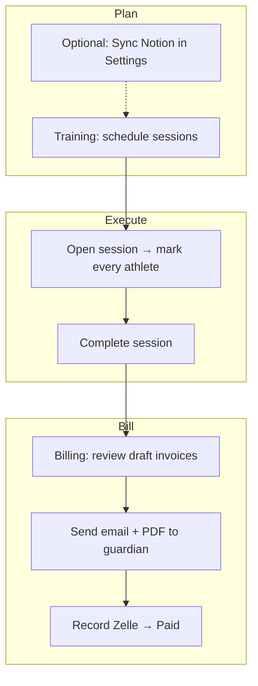

# Elite Atmosphere Training — Operating System

**Coach Portal** · Mobile-first control center for schedule, roster, attendance, and Zelle billing.

This is the day-to-day operating system for **Elite Atmosphere Training (EAT)**—built for **Coach Rico** as the sole admin. One login, one workflow: court-side attendance through month-end invoices, with Notion and Google Calendar plugged in where you already keep master data.

---

## What it replaces

| Before | Now |
|--------|-----|
| Scattered notes on who trained | **Attendance** per session, one tap per athlete |
| Mental math on rates | **Rate card** applied when attendance is saved (amount **locked** on that row) |
| Square or manual invoices | **Monthly family invoices** from attendance + package lines |
| Vague Zelle texts | **Email + PDF + guardian link**; you **record payment** when money lands |
| Paper / email enrollments | Public **`/enroll`** → **Pending** athletes on Home until you activate |

**Payments:** Zelle only—no card processing in the app.

**Families:** No parent login to the coach app. They use **enrollment** and **invoice links** only.

---

## Sign in

1. Open your live portal URL (or `http://localhost:3000` locally).
2. **Login** with **email + password** and/or **magic link** (same admin email).
3. Session lasts ~**30 days** on that device.

| Method | Notes |
|--------|--------|
| Password | Set or change under **Settings → Account** |
| Magic link | One-time link to inbox; expires in **30 minutes** (see login screen) |

Only the configured **admin email** can access the portal.

**Routes after login:** **Home** (`/home`) · **Training** (`/`) · **Roster** · **Billing** · **Settings**

---

## Operating rhythm

How the system expects you to run a typical day:



### Step-by-step

1. **Training** — Add or edit sessions (date, time, location, type, athletes). Optional **repeat** (weekly / monthly / yearly) when creating a batch.
2. **During / after session** — Open the session → set **Full**, **Half**, **Drop-in**, or **Absent** for **every** athlete on the roster → optionally **Copy from previous** for the same group.
3. **Complete** — Use the status control → **Completed**. The app saves attendance and, when billable, updates the family’s **draft invoice for that calendar month** in one step. You cannot complete until all athletes are marked.
4. **Billing** — Open drafts, **Refresh** if needed, add **package lines** (monthly / weekly Eat w/ EAT, etc.), **Preview** email, **Send**.
5. **Payment** — When Zelle arrives → **Record payment** → **Paid** (optional **receipt** email).

**Home** surfaces what needs you today: sessions, **Pending enrollments**, and billing queues (drafts, unpaid sent, sessions not yet invoiced).

---

## Navigation

| Tab | What it does |
|-----|----------------|
| **Home** | Greeting, local weather, today’s sessions, **Needs Attention**, month stats (sessions, revenue collected, outstanding invoices) |
| **Roster** | Athletes + guardian/family details (edit in one place); program and status filters |
| **Training** | Week strip + daily session list; create sessions |
| **Billing** | Year **Revenue** dashboard, invoice list, detail (send, pay, refresh) |
| **Settings** | Account, Google Calendar, Notion sync, live **rate card** |

---

## Roster & families

### Families = billing unit

- One **invoice per family per period** (siblings on one bill).
- Guardian name, email, and phone drive invoice emails and Zelle copy.
- Siblings are grouped by **primary guardian email** (enrollment and Notion sync use the same rule).

### Athletes

| Status | Meaning |
|--------|---------|
| **Pending** | Submitted via `/enroll` — review on **Home** or **Roster**, then set **Active** |
| **Active** | Schedule, attend, bill |
| **Archived** | Hidden by default; history retained |

**Programs:** An athlete can be on **Eat w/ EAT (full-time)** and/or **Private** (multi-select in profile). Session billing uses the **session type** when the athlete is enrolled in that program.

**Intake:** New athletes should use the public enrollment link (`/enroll`). You edit and activate them in the athlete profile modal (family + guardian fields live there—there is no separate family screen).

**Notion roster sync** (Settings) upserts athletes and families from your **Master Client Directory**. Manual edits in the portal and Notion can diverge until you sync again.

### Rates (important)

When attendance is **saved**, the system stores **`billed_rate`** on that row. Later rate card or Notion changes do **not** rewrite old rows.

| Athlete setup | Effect on attendance billing |
|---------------|------------------------------|
| Default | Rate card for program + attendance chip |
| **Rate override** (per athlete, API/Notion) | Custom $ for full-time / private-style flat rates; half-day = half of override |
| **Monthly prepay** (`rate_type: monthly`, often from Notion) | Eat w/ EAT attendance logs at **$0** — bill via **monthly package line** on the invoice |
| Drop-in chips | Always rate card drop-in prices; **override does not apply** |

**Private / semi-private sessions:** Billed **by the hour** from session start/end (quarter-hour rounding). Set times on the session.

**Eat w/ EAT without times:** Treated as a full-day block for rate math when hourly logic does not apply.

---

## Training — sessions & attendance

### Session types

| Type | Typical use |
|------|-------------|
| **Eat w/ EAT** | Full-time / daily program |
| **Private** | Private lesson |
| **Semi-private** | Semi-private lesson |

### Statuses

| Status | Billing |
|--------|---------|
| Scheduled | No billing yet |
| **Completed** | Attendance can invoice |
| Cancelled | No billing |
| Rescheduled | Update date/time as needed |

### Attendance chips

| Chip | Result |
|------|--------|
| Full | Full-day or full session charge |
| Half | Half-day rate |
| Drop-in Full / Half | Drop-in rate card |
| Absent | $0, not invoiced |

### Completing a session (current behavior)

- **Every** athlete on the session must have a chip before **Completed** is allowed.
- Choosing **Completed** saves attendance and runs **invoice auto-sync** for affected families.
- Toast examples: `Draft invoice EAT-000042 updated` or `Already on invoice EAT-000041`.
- **Copy from previous** pulls the last session’s marks for athletes still on today’s roster.

### Google Calendar

**Settings → Connect** pushes session create/update/cancel/delete to your **primary Google calendar** (portal → Google only, not import).

### Auto-sync did not run?

| Check | Action |
|-------|--------|
| Status not **Completed** | Complete the session (with full attendance) |
| Absent or $0 | Expected for monthly-prepay or absent |
| No family on athlete | Fix in Roster |
| Already invoiced | Session detail shows invoice link; don’t duplicate |
| Still stuck | **Sync to invoice** on session detail |

---

## Billing — invoices & revenue

### Lifecycle

```
Draft  →  Sent  →  Paid
```

| Status | Actions |
|--------|---------|
| **Draft** | Refresh from attendance, add/remove lines, delete, preview email, send |
| **Sent** | Guardian link active; record payment |
| **Paid** | Locked; resend **receipt** email if needed |

Numbers: **EAT-000001**, **EAT-000002**, … (never reused).

### Line items — three sources

1. **Auto** — Billable **completed** attendance in the invoice month (per family).
2. **Refresh** — Rebuilds attendance-based lines on a draft; keeps manual package lines you added.
3. **Manual services** — From the service catalog (Eat w/ EAT monthly/weekly/daily/half-day/drop-in, private, semi-private, travel). Use for **monthly prepay** and flat fees not tied to one session log.

### Billing screen

- **Revenue** header with **year** selector (2026+): total invoiced, collected, outstanding, **MRR (avg)** chart.
- List filters: this month, last month, last 3 months, all.
- **New Invoice** — empty draft for a family + date range.
- Detail: PDF, **Preview** due/paid email, **Send**, **Record payment**, **Send receipt** (paid).

### Guardian experience

**Send** emails:

- Branded HTML  
- PDF attachment  
- Magic link → `/invoice?token=…` (view amount, Zelle instructions, download PDF)

You confirm **Paid** manually when Zelle hits— the app does not read your bank.

---

## Public links (no coach login)

| Path | Audience |
|------|----------|
| `/enroll` | New families — athlete, guardians, medical, program |
| `/invoice?token=…` | Guardian — from invoice email |

**After enroll:** Athlete is **Pending** → open from **Home** → confirm → **Active** → add to sessions.

Share enrollment as: `https://<your-domain>/enroll` (login page also links **New athlete? Enroll here**).

---

## Settings & integrations

### Rate card

- Live grid of services (Eat w/ EAT packages, private, semi-private, travel, …).
- **Source:** Notion when configured, else built-in defaults on server start.
- **View all** opens the full list.

### Notion (one **Sync** button)

| Pulls | Into |
|-------|------|
| Service rates database | Portal rate card |
| Master Client Directory | Athletes + families |

Run sync before a heavy billing week if Notion is your source of truth. Errors show under the Notion row.

### Google Calendar

Connect / disconnect in **Integrations**. Sessions sync as events on the connected account.

### Account

Update password without relying on magic link on poor court Wi‑Fi.

---

## Rules of the system

1. **Snapshot billing** — Disputes are settled against what was stored at attendance save.  
2. **Calendar month** — Auto drafts use the month of the **session date**.  
3. **Complete + billable** — Drives automatic line items (except monthly prepay at $0 attendance).  
4. **Honor-system Zelle** — You mark paid; no processor webhooks.  
5. **Single admin** — One operator account; not a multi-coach product yet.

---

## Not built (boundaries)

- Parent/athlete portal (only enroll + invoice links)  
- Card payments (Stripe, Square checkout, etc.)  
- Automatic Zelle detection  
- SMS / push reminders  
- Multi-coach roles  
- Import **from** Google Calendar into the portal  
- Bulk export (e.g. ZIP of all PDFs)—manual per invoice today  

Notion and Google Calendar **are** supported; they are optional if you run everything inside the portal.

---

## Troubleshooting

| Issue | Try |
|-------|-----|
| Can’t log in | Admin email only; password or new magic link; check spam |
| Enrollment missing | Reload Home; Roster → status **Pending** |
| Can’t complete session | Mark **all** athletes first |
| Draft invoice empty | **Completed**? Not all absent? **Refresh** draft |
| Wrong amount | Fix attendance on session (if not on sent/paid invoice), then **Refresh**; check monthly prepay vs daily lines |
| Double charge | Session detail billing badge; only delete **draft** invoices |
| Email not received | Guardian email on family; spam; production domain must be verified (developer) |
| Notion sync failed | Read error in Settings; confirm API key + database IDs |
| Google event wrong | Edit session in portal; reconnect if needed |
| Undo sent invoice | No undo in app—handle credit outside or with developer |

---

## For developers

Architecture notes: `memory/PRD.md` (may lag the app; code wins).

**Local run**

```bash
# API — http://127.0.0.1:8001
cd backend && ./run.sh

# UI — http://localhost:3000
cd frontend && cp .env.local.example .env.local  # optional
yarn install && yarn start
```

**Backend needs:** MongoDB, `JWT_SECRET`, `ADMIN_EMAIL`, `APP_BASE_URL`, `RESEND_API_KEY`, `SENDER_EMAIL`.  
**Optional:** `NOTION_*`, Google OAuth vars, `ADMIN_PASSWORD`, `DEV_MODE=true` (shows magic links on login for testing).

Do **not** commit real `.env` files—use host secrets or `.env.example` templates.

---

## Support

For hosting, credentials, or feature work, contact whoever maintains this deployment. This README is the operator manual for running EAT inside the portal day to day.
