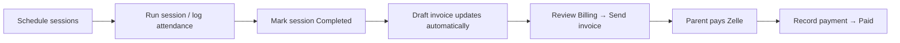

# Elite Atmosphere Training — Coach Portal

A guide for **Coach Rico** (and anyone operating the program day to day). This app replaces the old patchwork of calendar notes, Square, and manual Zelle follow-up with one place to run schedule, roster, attendance, and billing.

---

## What this is

**Elite Atmosphere Training (EAT) Portal** is an operating system for you.

| You used to… | The portal does… |
|--------------|------------------|
| Track who showed up in your head or on paper | Log attendance per session with one tap per athlete |
| Guess what to charge | Applies your **rate card** automatically when attendance is saved |
| Build invoices in Square or by hand | Builds **monthly family invoices** from attendance (plus manual lines for monthly/weekly packages) |
| Chase Zelle with vague texts | Sends a branded **email + PDF + payment link**; you mark paid when Zelle lands |
| Re-type new enrollments from forms | Public **enrollment page** creates pending athletes for you to approve |

**Payments:** Zelle only. There is no card processor inside the app—you record when money arrives.

**Parents/athletes:** They do not log into the coach portal. They use the enrollment link and invoice links you email them.

---

## How to sign in

1. Open the portal URL your developer gave you (production) or `http://localhost:3000` when testing locally.
2. On **Login**, use either:
   - **Email + password** (if set up in Settings), or
   - **Magic link** — enter your admin email, check inbox, tap the link (expires in 15 minutes, one-time use).
3. You stay signed in for about **30 days** on that device.

Only the email configured as admin can sign in. There is no second coach account in this version.

---

## The daily loop (recommended rhythm)

This is the intended workflow court-side and at the desk:



**In plain steps:**

1. **Training** — Create or edit sessions for the week. Athletes on the session are who you’ll mark present.
2. **After practice** — Open the session → tap attendance chips (Full, Half, Drop-in, Absent) → **Save attendance**.
3. **Complete the session** — Change status to **Completed** when you’re done (attendance can be saved before or after; billing cares that the session is completed).
4. **Billing** — Each family gets a **draft invoice for the calendar month**. Saving attendance on completed sessions usually adds lines automatically. Review, adjust if needed, **Send**.
5. **When Zelle hits** — Open the invoice → **Record payment** → status becomes **Paid** (receipt email can go out).

**Home** is your dashboard: today’s sessions, pending enrollments, and billing alerts (drafts, unpaid sent invoices, sessions not yet on an invoice).

---

## Navigation (five tabs)

| Tab | Purpose |
|-----|---------|
| **Home** | Today’s schedule, weather, month revenue snapshot, action items |
| **Roster** | Athletes and families — add, edit, archive, rate overrides |
| **Training** | Weekly calendar — create sessions, open session detail |
| **Billing** | Invoices by family/month — generate, refresh, send, mark paid |
| **Settings** | Rate card, Notion sync, Google Calendar, password |

---

## Roster — athletes & families

### Families

- A **family** is the billing unit (one invoice can cover siblings).
- Primary guardian email/phone/name are used on invoices and emails.
- Siblings share a family when they match the same primary email (Notion sync does this too).

### Athletes

- Each athlete belongs to one family.
- **Program** (Eat w/ EAT full-time, Private, Semi-private) drives default pricing.
- **Status:**
  - **Active** — on roster, can be scheduled and billed.
  - **Pending** — from the public enrollment form; appears on **Home** until you activate them.
  - **Archived** — hidden from default filters; history kept.

### Rate override

On an athlete profile you can set a **custom rate** (e.g. scholarship or special deal). When you save attendance, the app **snapshots** the dollar amount into that attendance row. Changing the rate card or override later does **not** change past attendance—only new saves.

**Workaround:** Wrong charge on a past day? Edit attendance on that session and save again (if not already locked on a sent/paid invoice), or add a manual adjustment line on a **draft** invoice.

---

## Training — sessions & attendance

### Creating a session

- Pick **date**, **time**, **location**, **session type** (full-time / private / semi-private), and **athletes**.
- If **Google Calendar** is connected (Settings), the session is pushed to your Google calendar automatically (one-way: portal → Google).

### Session statuses

| Status | Meaning |
|--------|---------|
| Scheduled | Upcoming |
| Completed | Done — attendance counts toward billing |
| Cancelled | No billing |
| Rescheduled | Use when moving; edit date/time as needed |

### Attendance chips

| Chip | Billing |
|------|---------|
| **Full** | Full-day or full session rate (from rate card × hours if times are set) |
| **Half** | Half of full-day, or half of override for full-time |
| **Drop-in Full / Half** | Drop-in rates (override on athlete does **not** apply to drop-ins) |
| **Absent** | $0 — not added to invoice |

**Tip:** Set **start and end time** on sessions when possible. Private/semi-private default to 1 hour; full-time without times assumes a full day block for rate math.

### After you save attendance

If the session is **Completed** and the mark is billable (not absent, rate &gt; 0), the app updates that family’s **draft invoice for that month**. You’ll see a toast like “Draft invoice EAT-000042 updated.”

**Workaround — nothing added to invoice?**

- Session not **Completed** yet → complete it first.
- Athlete marked **Absent** or $0 rate → expected.
- Athlete has no family linked → fix in Roster.
- Already on another invoice → session detail shows billing status; don’t double-bill.

**Workaround — manual sync:** On session detail, use **Sync to invoice** if auto-sync didn’t run.

---

## Billing — invoices

### Invoice lifecycle

```
Draft → Sent → Paid
```

| Status | What you can do |
|--------|-----------------|
| **Draft** | Refresh lines from attendance, add manual service lines, edit, delete, send |
| **Sent** | Record payment; guardian link still works |
| **Paid** | Locked; payment recorded; receipt-style view |

Invoice numbers look like **EAT-000001** and count up forever.

### How line items get on the invoice

1. **Automatic** — Completed sessions with saved billable attendance in the invoice’s month (per family).
2. **Refresh** — On a draft, **Refresh** rebuilds attendance-based lines from the period (keeps manual monthly/weekly package lines you added).
3. **Manual** — Add preset lines from the rate card (e.g. “Eat w/ EAT · Monthly”) for flat fees not tied to a single session.

Siblings on the same family → **one invoice** with separate lines per athlete.

### Sending

**Send** emails the guardian:

- Branded HTML email  
- PDF attachment  
- Link to view/pay instructions on the web (`/invoice?token=…`)

Zelle instructions come from your business settings (email/phone/name on file).

### Recording payment

When Zelle arrives: amount, date, method (Zelle presets), optional note → **Paid**. You can send a paid confirmation email from the same flow.

**Workaround — parent says they didn’t get email:** Check spam; confirm guardian email on the family; resend from invoice detail. Developer must have email domain verified in production.

**Workaround — wrong total on draft:** **Refresh** the draft, or fix attendance on sessions then refresh. For package billing, add/adjust manual lines.

**Workaround — need a new month or wrong family:** Only **draft** invoices can be deleted. Create a new invoice (Billing → generate) for the right family and period.

---

## Public pages (share these links)

These work **without** coach login:

| Link | Who uses it |
|------|-------------|
| **`/enroll`** | New families — athlete info, guardians, medical, program interest |
| **`/invoice?token=…`** | Guardian — view amount due, Zelle info, download PDF (token from email) |

After enrollment, the athlete is **Pending** on **Home** — open them in Roster, confirm details, set to **Active**, assign family if needed, then schedule sessions.

---

## Settings — connections & rate card

### Rate card

Shows current prices (Eat w/ EAT monthly/weekly/daily/drop-in, private, semi-private, travel, etc.). Source of truth can be:

- **Notion** — if connected, use **Sync from Notion** to pull latest rates and roster.
- Built-in defaults — if Notion isn’t configured.

Changing Notion does **not** change past attendance snapshots—only new attendance picks up new rates.

### Notion sync

One button syncs:

- **Rates** from your Notion rate database  
- **Roster** from Master Client Directory (athletes + families, sibling matching by email)

**Workaround — athlete missing after sync:** Check they’re Active in Notion and mapped fields match (name, email, program). You can still add athletes manually in Roster.

**Workaround — Notion out of date:** Run sync before a billing week; avoid editing the same athlete in both places at once without re-syncing.

### Google Calendar

Connect once in Settings. New/updated/cancelled sessions push to your primary Google calendar. Disconnect stops future pushes; old events stay in Google.

**Workaround — event wrong in Google:** Fix the session in the portal (edit time/athletes); the app tries to update the linked Google event.

### Password

Optional but recommended on phone: set password in Settings so you can log in without waiting for magic link email on court Wi‑Fi.

---

## Concepts worth remembering

1. **Billed rate is frozen at attendance save** — protects you from “you changed the price” disputes.  
2. **Billing is monthly per family** — period is the calendar month of the session date.  
3. **Completed + billable attendance** drives auto-invoice lines.  
4. **Zelle is honor system** — the app doesn’t detect bank deposits; you mark paid.  
5. **Single admin** — built for one operator, not a staff team.

---

## What this app does *not* do (yet)

- No parent login portal (only enroll + invoice links).  
- No credit card / Stripe / Square charging inside the app.  
- No SMS reminders.  
- No automatic “paid” detection from Zelle.  
- No multi-coach permissions.  
- Google Calendar is **outbound only** (portal does not import Google events into the app).  
- Notion is optional; without it, manage roster and rates inside the app.

---

## Troubleshooting cheat sheet

| Problem | What to try |
|---------|-------------|
| Can’t log in | Confirm admin email; try password; request new magic link; check spam |
| Enrollment didn’t appear | Refresh Home; filter Roster by Pending |
| Attendance won’t save | Network; session exists; athletes still on session roster |
| Invoice empty | Session **Completed**? Attendance not Absent? **Refresh** draft |
| Duplicate line / double charge | Check session billing badge; delete only if still **draft** |
| Rate looks wrong | Check athlete **rate override**; drop-ins ignore override; check session times |
| Email not delivered | Verify family email; developer checks Resend/domain |
| Google event missing | Reconnect Google in Settings; save session again |
| Notion sync failed | Settings shows error; verify Notion API + database IDs with developer |
| Need to undo sent invoice | No automatic undo—work with developer or issue credit manually (process outside app) |

---

## For your developer (short)

Technical detail lives in `memory/PRD.md`. Local run:

**Backend** (port 8001):

```bash
cd backend
./run.sh
```

**Frontend** (port 3000):

```bash
cd frontend
cp .env.local.example .env.local   # optional
yarn install && yarn start
```

Requires MongoDB, Resend API key, `JWT_SECRET`, `ADMIN_EMAIL`, `APP_BASE_URL`, and related env vars in `backend/.env`. Optional: Notion tokens, Google OAuth client, `DEV_MODE=true` exposes magic links on login for testing.

---

## Support

For bugs, new features, or production access, contact whoever built or hosts this deployment. Day-to-day tennis operations stay in your hands—this guide is the map for doing that inside the portal.
